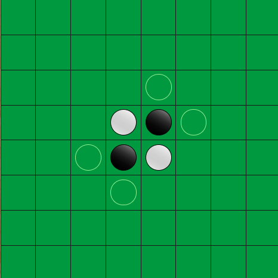

# Reversi

## Basic rules
Each reversi piece has a black side and a white side. On your turn, you place one piece on the board with your color facing up. You must place the piece so that an opponent's piece, or a row of opponent's pieces, is flanked by your pieces. All of the opponent's pieces between your pieces are then turned over to become your color.

## Aim of the game
The object of the game is to own more pieces than your opponent when the game is over. The game is over when neither player has a move. Usually, this means the board is full.

## Start of the game
The game is started in the position shown below on a reversi board consisting of 64 squares in an 8x8 grid.

## Playing the game
A move consists of placing one piece on an empty square.

## Capture
You can capture vertical, horizontal, and diagonal rows of pieces. Also, you can capture more than one row at once.

## End of the game

The game ends when:
One player wins, by making his color dominant on the board.
The players agree to finish the game (as a resignation, or a draw).
